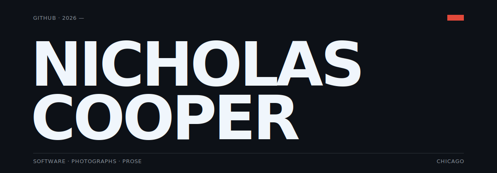

<picture>
  <source media="(prefers-color-scheme: dark)" srcset="./assets/header-dark.svg">
  <source media="(prefers-color-scheme: light)" srcset="./assets/header-light.svg">
  
</picture>

<br>

Projects, experiments, and working material. Curated work lives at **[nicholascullencooper.com](https://nicholascullencooper.com)**.

<br>

## ↳ Currently

```
April 2026   building diverge, shipping bball.dev,
             writing intermittently, taking fewer
             photographs than I'd like.
```

<br>

## ↳ In progress (not yet public)

| | | | |
|---|---|---|---|
| `diverge`    | `2026` | `ts · rs · tauri` | AI research desktop app. Multi-source RAG, claim extraction, cross-document comparison. |
| `bball.dev`  | `2026` | `ts · react`      | NBA analytics with custom visualization and algorithmic story detection. Live product. |
| `sediment`   | `2026` | `ts · postgis`    | Real-time global event intelligence map. Seven ingest adapters, editorial design system. |

<br>

## ↳ Public work

| | | | |
|---|---|---|---|
| `csaw`       | `2026` | `go`             | AI config registry. Mount, don't install. Cross-platform; on Homebrew, Scoop, PyPI. |
| `dotghost`   | `2025` | `ts`             | The TypeScript predecessor to csaw. npm package. |
| `redtape`    | `2025` | `md · workflow`  | Portable workflow pack that makes coding agents surface risk before acting. |
| `dotagent`   | `2025` | `md · workflow`  | Reusable registry of agent roles, commands, workflows, and skills. |

<br>

## ↳ Elsewhere

```
site           nicholascullencooper.com
writing        nicholascullencooper.com/writing
photography    instagram.com/nicholascullencooper
bluesky        bsky.app/profile/nicholascullencooper.com
```
